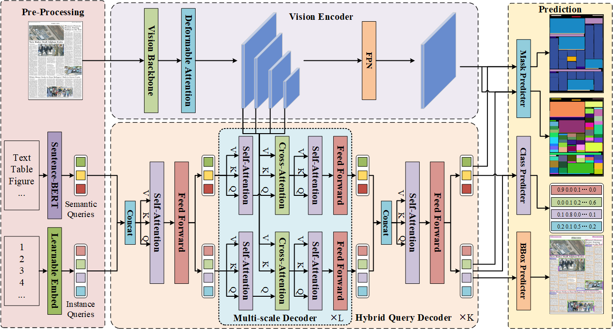

# DocSAM: Unified Document Image Segmentation via Query Decomposition and Heterogeneous Mixed Learning (CVPR 2025)
## Features
- A uified model for various document segmentation tasks and datasets.
- A pretrained model that can be seemlessly migrate to new segmentation tasks.


## Introduction

DocSAM makes two significant improvements compared to existing methods. First, it transforms various document image segmentation tasks into a unified paradigm of mask-based instance segmentation and semantic segmentation. Second, it embeds class names into semantic queries, which not only serve as prompts to guide the model in identifying specific types of regions to segment but also function as class prototypes that instance queries depend on for classification.

After mixed pretraining on heterogeneous tasks and datasets, the DocSAM model can be directly used as a versatile document segmenter or as a pre-trained model that can be seamlessly fine-tuned using task-specific datasets without any specialized modifications, such as adding or replacing a linear classification layer. This merit of DocSAM endows it with the potential for continual and incremental learning. The framework of DocSAM is shown in the figure below. 





## Installation
```
conda create --name DocSAM python=3.11 -y
conda activate DocSAM

git clone git@github.com:xhli-git/DocSAM.git
cd DocSAM
pip install -r requirments.txt
```

## Getting Started
### Preparing Datasets
All dataset annotations must be converted to the unified COCO format. We provide a [demo dataset](https://drive.google.com/file/d/1gvfco5zyRDASGO2BOYCjZuRxbN7MHhsT/view?usp=drive_link) to illustrate the structure and format of the datasets used during training and testing. Please download it and place it in the designated 'data' folder. You can prepare your own data according to the structure and guidelines outlined in this demo dataset.

### Preparing Weights
DocSAM is build upon Mask2Former and Sentence-BERT, please download their pretrained weights from huggingface and place them in the designated 'pretrained_model' folder.
- Download [mask2former-swin-base-coco-panoptic](https://huggingface.co/facebook/mask2former-swin-base-coco-panoptic) and place it in the designated './pretrained_model/mask2former' folder.
- Download [mask2former-swin-large-coco-panoptic](https://huggingface.co/facebook/mask2former-swin-large-coco-panoptic) and place it in the designated './pretrained_model/mask2former' folder.
- Download [all-MiniLM-L6-v2](https://huggingface.co/sentence-transformers/all-MiniLM-L6-v2) and place it in the designated './pretrained_model/sentence' folder.
- Download pretrained DocSAM weights from the Model Zoo below and place them in the designated './pretrained_model' folder.

### Run Inference Demo
Make sure the configurations in run_test_demo.sh meet your requirements and run: 
```
sh run_test_demo.sh
```

### Run Training Demo
Make sure the configurations in run_train_demo.sh meet your requirements and run: 
```
sh run_train_demo.sh
```

### Full Size Training
Make sure you have prepared your datasets according to the [demo dataset](https://drive.google.com/file/d/1gvfco5zyRDASGO2BOYCjZuRxbN7MHhsT/view?usp=drive_link), and the configurations in run_train.sh meet your requirements, then run:
```
sh run_train.sh
```

We also provide a training script run_train_curriculum.sh for curriculum learning, which progressively incorporates new datasets into the training process to accelerate model convergence.


## Model Zoo
As an all-in-one model, DocSAM was pre-trained on nearly 50 datasets. We provide pre-trained weights for two model variants: DocSAM-Base and DocSAM-Large, with their visual backbones based on Swin-Base and Swin-Large, respectively. Additionally, we offer several specialized models fine-tuned on specific datasets. Information and download links for these pre-trained models are listed in the table below.

<table><tbody>
<!-- START TABLE -->
<!-- TABLE HEADER -->
<th valign="bottom">Name</th>
<th valign="bottom">Backbone</th>
<th valign="bottom">#Parameter</th>
<th valign="bottom">BatchSize</th>
<th valign="bottom">#Iterations</th>
<th valign="bottom">Download</th>
<!-- TABLE BODY -->
<!-- ROW: docsam_base_all_dataset -->
<tr>
<td align="left">docsam_base_all_dataset</td>
<td align="center">swin-base</td>
<td align="center">208M</td>
<td align="center">32</td>
<td align="center">360k</td>
<td align="center"><a href="https://drive.google.com/file/d/1M7Zc63eBGTKjynkmQ-2sI3m2WBvzqMO4/view?usp=drive_link">model</a></td>
</tr>
<!-- ROW: docsam_large_all_dataset -->
<tr>
<td align="left">docsam_large_all_dataset</td>
<td align="center">swin-large</td>
<td align="center">317M</td>
<td align="center">32</td>
<td align="center">360k</td>
<td align="center"><a href="https://drive.google.com/file/d/1YvdDMtnDpfZTyxF59z3gbK2FKrfHaxJn/view?usp=drive_link">model</a></td>
</tr>
<!-- ROW: docsam_large_m6doc -->
<tr>
<td align="left">docsam_large_m6doc</td>
<td align="center">swin-large</td>
<td align="center">317M</td>
<td align="center">16</td>
<td align="center">40k</td>
<td align="center"><a href="https://drive.google.com/file/d/1bs8DGooP5zAu2I8fNRqpdjSHCnT2kPNm/view?usp=drive_link">model</a></td>
</tr>
<!-- ROW: docsam_large_scut_cab -->
<tr>
<td align="left">docsam_large_scut_cab</td>
<td align="center">swin-large</td>
<td align="center">317M</td>
<td align="center">16</td>
<td align="center">40k</td>
<td align="center"><a href="https://drive.google.com/file/d/1BUmYz1jClnPfPycOSaNsB0jL3wM1qYCX/view?usp=drive_link">model</a></td>
</tr>
<!-- ROW: docsam_large_ctw1500 -->
<tr>
<td align="left">docsam_large_ctw1500</td>
<td align="center">swin-large</td>
<td align="center">317M</td>
<td align="center">16</td>
<td align="center">40k</td>
<td align="center"><a href="https://drive.google.com/file/d/1kO6Pyk4h36fnVRzVQJ5cScfFkFMchqOd/view?usp=drive_link">model</a></td>
</tr>
<!-- ROW: docsam_large_totaltext -->
<tr>
<td align="left">docsam_large_totaltext</td>
<td align="center">swin-large</td>
<td align="center">317M</td>
<td align="center">16</td>
<td align="center">40k</td>
<td align="center"><a href="https://drive.google.com/file/d/1aiN_C9eHC0fRX27CPRu8Jfaz5DQiz83D/view?usp=drive_link">model</a></td>
</tr>
</tbody></table>


## License

Shield: [](https://opensource.org/licenses/MIT)

The majority of DocSAM is licensed under a [MIT License](LICENSE).

However portions of the project are available under separate license terms: Swin-Transformer-Semantic-Segmentation is licensed under the [MIT license](https://github.com/SwinTransformer/Swin-Transformer-Semantic-Segmentation/blob/main/LICENSE), Deformable-DETR is licensed under the [Apache-2.0 License](https://github.com/fundamentalvision/Deformable-DETR/blob/main/LICENSE).


## Citation
If you find DocSAM helpful for your research or wish to refer to the baseline results published in our paper, please use the following BibTeX entry.

```BibTeX
@inproceedings{li2025docsam,
  title={DocSAM: Unified Document Image Segmentation via Query Decomposition and Heterogeneous Mixed Learning},
  author={Xiao-Hui Li and Fei Yin and Cheng-Lin Liu},
  journal={CVPR},
  year={2025}
}
```


## Acknowledgement

Code is largely based on [Mask2Former](https://github.com/facebookresearch/Mask2Former).

Pretrained weights of [Mask2Former](https://huggingface.co/facebook/mask2former-swin-large-coco-panoptic) and [all-MiniLM-L6-v2](https://huggingface.co/sentence-transformers/all-MiniLM-L6-v2) are downloaded from huggingface.
